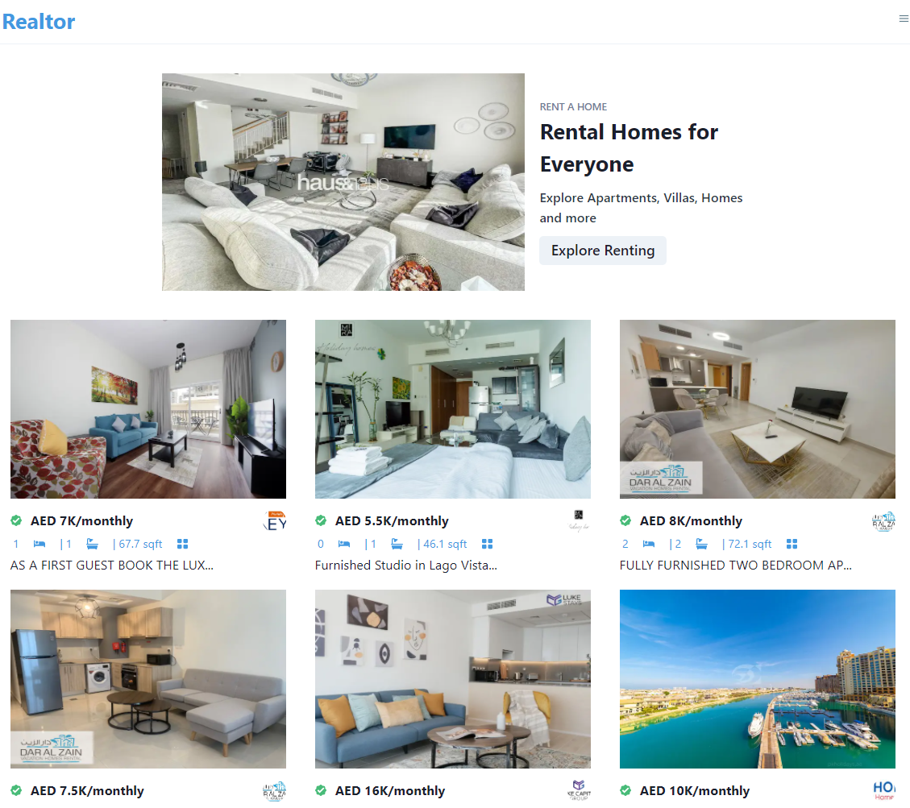

# REALTOR

## Introduction
Build and Deploy an Real Estate Application Bayut API, Charkar-UI and Next.js

Live

## Features
    - Fetching Real Estate Data
    - Data Filtering

## Setup:
    - Create a .env.local of your own and include the API for BAyut
    - npm run dev to start the development server.

## Dependencies
    - @chakra-ui/react
    - axios
    - millifiy
    - nprogress
    - react-horizontal-scrolling-menu
    - react-icons
